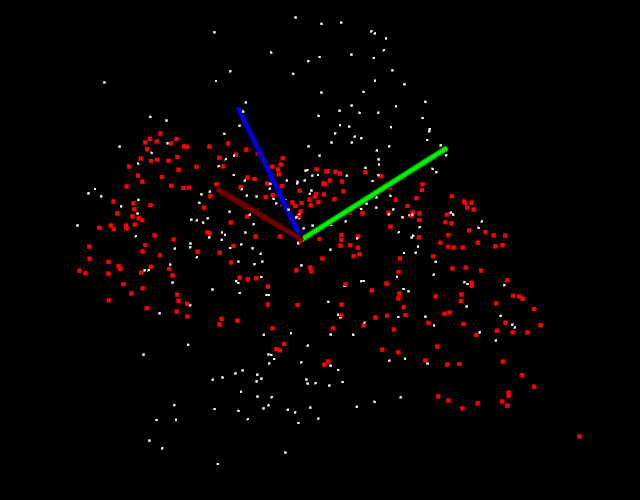
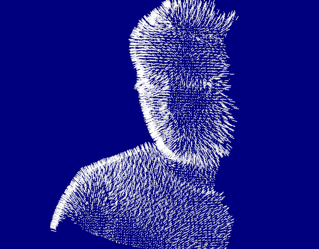

# 学习目标
* 能够进行点云滤波Filtering
* 能够使用直通滤波PassThrough处理点云
* 能够对点云进行降采样Downsampling
* 能够独立使用工具进行降采样
* 能够从点云创建深度图
* 能够从深度图中提取边界
* 能够理解关键点的概念及算法
* 能够理解采样一致性算法RANSAC
* 能够说出特征描述与提取的作用
* 能够理解特征点
* 能够进行表面法向量估算
* 能够提取点云的PFH描述子

## 1.滤波Filtering

直通滤波器：

```c++
pcl::PassThrough<pcl::PointXYZ>pass;
pass.setInputCloud(cloud);  //设置输入原
pass.setFilterFieldName("z");   //设置过滤域名
pass.setFilterLimits(0.0, 1.0); //设置过滤范围
//pass.setFilterLimitsNegative(true);   //设置过滤范围
pass.filter(*cloud_filtered);    //执行过滤，将结果输出到cloud-filtered
```

体素滤波器：

```c++
float leftSize = 0.01f;
//Create the filtering object
pcl::VoxelGrid<pcl::PCLPointCloud2> sor;
sor.setInputCloud(cloud);
sor.setLeafSize(leftSize, leftSize, leftSize);
sor.filter(*cloud_filtered);
```

离散点滤波：

```c++
//Create the filtering object
pcl::StatisticalOutlierRemoval<pcl::PointXYZ> sor;
sor.setInputCloud(cloud);
//设置平均距离估计的最近距离数量K
sor.setMeanK(50);
//设置标准差异阀值系数
sor.setStddevMulThresh(1.0);
//执行过滤
sor.filter(*cloud_filtered);
```

半径离群滤波，条件滤波

```c++
//半径滤波
pcl::RadiusOutlierRemoval<pcl::PointXYZ> outrem;//半径离群值删除
//build th filter
outrem.setInputCloud(cloud);
outrem.setRadiusSearch(0.4);
outrem.setMinNeighborsInRadius(2);
//aply filter
outrem.filter(*cloud_filtered);

//条件滤波
//build the condition（条件）
pcl::ConditionAnd<pcl::PointXYZ>::Ptr range_cond(new pcl::ConditionAnd<pcl::PointXYZ>());
range_cond->addComparison(pcl::FieldComparison<pcl::PointXYZ>::ConstPtr(
    new pcl::FieldComparison<pcl::PointXYZ>("z", pcl::ComparisonOps::GT, 0.0)));

range_cond->addComparison(pcl::FieldComparison<pcl::PointXYZ>::ConstPtr(
    new pcl::FieldComparison<pcl::PointXYZ>("z", pcl::ComparisonOps::LT, 0.8)));

//build the filter
pcl::ConditionalRemoval<pcl::PointXYZ> condrem;
condrem.setCondition(range_cond);
condrem.setInputCloud(cloud);
condrem.setKeepOrganized(true);
//apply filter
condrem.filter(*cloud_filtered);
```


## 2.深度图RangeImage

```c++
createFromPointCloud(pointCloud, angularResolution, maxAngleWidth, maxAngleHeight,
sensorPose, coordinate_frame, noiseLevel, minRange, borderSize)
```


- **pointCloud**：被检测点云
- **angularResolution=1**：邻近的像素点所对应的每个光束之间相差 1°
- **maxAngleWidth=360**：进行模拟的距离传感器对周围的环境拥有一个完整的360°视角，无论任何数据集都推荐使用此设置，因为最终获取的深度图像将被裁剪到有空间物体存在的区域范围
- **maxAngleHeight=180**： 当传感器后面没有可以观测的点时，设置一个水平视角为180°的激光扫描仪即可，因为需要观察距离传感器前面就可以了。
- **sensorPose**： 定义了模拟深度图像获取传感器的6DOF（6自由度）位置，其原始值为横滚角roll、俯仰角 pitch、偏航角 yaw 都为 0
- **coordinate_frame**： 设置为CAMERA_FRAME说明系统的X轴是向右的、Y轴是向下的、Z轴是向前的，另外参数值是LASER_FRAME，其X轴向前、Y轴向左、Z轴向上
- **noiseLevel=0**： 是指使用一个归一化的 Z缓存区来创建深度图像，如果想让邻近点集都落在同一个像素单元，可以设置一个较高的值，例如 noiseLevel = 0.05 可以理解为深度距离值是通过查询点半径为 5cm 的圆内包含的点用来平均计算而得到的 。
- **minRange=0**：如果设置>0则所有模拟器所在位置半径 minRange 内的邻近点都将被忽略，即为盲区。
- **borderSize=1**：如果设置>0 ,在裁剪图像时，将在图像周围留下当前视点不可见点的边界 。

## 3.关键点KeyPoints

NARF（Normal Aligned Radial Feature）关键点是为了从深度图像中识别物体而提出的，关键点探测的重要一步是减少特征提取时的搜索空间，把重点放在重要的结构上，对 NARF 关键点提取过程有以下要求：

- 提取的过程必须考虑边缘以及物体表面变化信息
- 即使换了不同的视角，关键点的位置必须稳定的可以被重复探测
- 关键点所在的位置必须有稳定的支持区域，可以计算描述子和估计唯一的法向量。

为了满足上述要求，可以通过以下探测步骤来进行关键点提取：

1. 遍历每个深度图像点，通过寻找在近邻区域有深度突变的位置进行边缘检测；
2. 历每个深度图像点，根据近邻区域的表面变化决定一测度表面变化的系数，以及变化的主方向；
3. 根据第2步找到的主方向计算兴趣值，表征该方向与其他方向的不同，以及该处表面的变化情况，即该点有多稳定；
4. 对兴趣值进行平滑过滤；
5. 进行无最大值压缩找到最终的关键点，即为 NARF 关键点。

## 4.随机采样一致性RANSAC

RANSAC是“RANdom SAmple Consensus”（随机抽样共识或采样一致性）的缩写，它是一种迭代方法，用于从包含异常值的一组数据中估计数学模型的参数。

RANSAC算法假定我们要查看的所有数据均由内部值和异常值组成。可以用带有一组特定参数值的模型来解释离群值，而离群值在任何情况下都不适合该模型。其过程可以从数据中估计所选模型的最佳参数。

左图和右图（来自[Wikipedia]）显示了RANSAC算法在二维数据集上的简单应用。我们左边的图像是包含内部值和异常值的数据集的可视表示。右边的图像以红色显示所有异常值，以蓝色显示内部值。蓝线是RANSAC完成的工作的结果。在这种情况下，我们尝试拟合数据的模型是一条直线，看起来很适合我们的数据。


PCL 中以随机采样一致性算法( RANSAC) 为核心，实现了五种类似于RANSAC的随机参数估计算法，例如随机采样一致性估计（RANSAC ) 、最大似然一致性估计 （MLESAC ) 、最小中值方差一致性估计 ( LMEDS )等，所有的估计参数算法都符合一致性准则。**利用RANSAC可以实现点云分割**，目前 PCL 中支持的几何模型分割有 空间平面、直线、二维或三维圆、圆球、锥体等 。 **RANSAC的另一应用就是点云的配准对的剔除**。

**RANSAC算法简介**

RANSAC从样本中随机抽选出一个样本子集，使用最小方差估计算法对这个子集计算模型参数，然后计算所有样本与该模型的偏差，再使用一个预先设定好的阈值与偏差比较，当偏差小于阈值时，该样本点属于模型内样本点 ( inliers），或称内部点、局内点或内点，否则为模型外样本点（outliers），或称外部点、局外点或外点，记录下当前的 inliers 的个数，然后重复这一过程。每一次重复都记录当前最佳的模型参数，所谓最佳即是inliers的个数最多 ，此时对应的inliers个数为 best_ninliers 。 每次迭代的末尾都会根据期望的误差率、 best_ninliers、总样本个数、当前迭代次数，计算一 个迭代结束评判因子，据此决定是否迭代结束。迭代结束后，最佳模型参数就是最终的模型参数估计值 。

RANSAC理论上可以剔除outliers的影响，并得到全局最优的参数估计。但是RANSAC 有两个问题，首先在每次迭代中都要区分 inliers 和 outlieres，因此需要事先设定阈值，当模型具有明显的物理意义时，这个阈值还比较容易设定，但是若模型比较抽象时，阈值就不那么容易设定了。而且固定阈值不适用于样本动态变化的应用；第二个问题是，RANSAC的迭代次数是运行期决定的，不能预知迭代的确切次数（当然迭代次数的范围是可以预测的）。除此之外， RANSAC 只能从一个特定数据集中估计一个模型，当两个（或者更多个）模型存在时，RANSAC 同时找到多个模型。

* 执行`random_sample_consensus -f` 创建包含外部点的平面，并计算平面内部点



* 执行`random_sample_consensus -sf`创建包含外部点的球体，并计算球体内部点




## 05.随机采样一致性算法RANSAC

## 06.特征描述与提取Features

## 07.点云表面法线估算

## 08.特征检测与描述子

特征描述子 Feature Descriptor

- 是每个特征点独特的身份认证
- 同一空间点在不同视角的特征点具有高度相似的描述子
- 不同特征点的描述子差异性尽量大
- 通常描述子是一个具有固定长度的向量

描述子可以分为以下几种类型：基于不变性的描述子、基于直方图的描述子、二进制描述子

PCL主要实现了：

NARF特征点描述子、PFH（FPFH）点特征直方图描述子、RoPs 特征、VFH视点特征直方图描述子、GASD全局对齐的空间分布描述子、基于惯性矩和偏心率的描述子