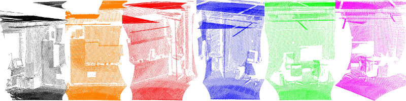

# 学习目标

- 了解方差、协方差、雅克比矩阵、黑塞矩阵
- 能够说出点云配准的基本步骤
- 能够说出点云配准的需求场景
- 能够使用`ICP算法`对点云进行配准操作
- 能够使用`NDT正态分布变换`对点云进行配准

## 1.点云中的数学


## 点云配准方法

点云配准步骤上可以分为粗配准（Coarse Registration）和精配准（Fine Registration）两个阶段。

**粗配准**是指在点云相对位姿完全未知的情况下对点云进行配准，找到一个可以让两块点云相对近似的旋转平移变换矩阵，进而将待配准点云数据转换到统一的坐标系内，可以为精配准提供良好的初始值。常见粗配准算法：

- 基于特征匹配(PFH)的配准算法：
  - SAC-IA 采样一致性初始配准算法（Sample Consensus Initial Alignment）PCL库已实现，基于FPFH
- 基于穷举搜索的配准算法：
  - 4PCS 四点一致集配准算法（4-Point Congruent Set）
  - Super4PCS

**精配准**是指在粗配准的基础上，让点云之间的空间位置差异最小化，得到一个更加精准的旋转平移变换矩阵。该算法的运行速度以及向全局最优化的收敛性却在很大程度上依赖于给定的**初始变换估计**以及在迭代过程中**对应关系的确立**。所以需要各种粗配准技术为ICP算法提供较好的位置，在迭代过程中确立正确对应点集能避免迭代陷入局部极值，决定了算法的收敛速度和最终的配准精度。最常见的精配准算法是ICP及其变种。

- ICP 迭代最近点算法（Iterative Cloest Point）
  - GICP
  - NICP
  - MBICP
- NDT 正态分布变换算法（Normal Distributions Transform）

**其他配准：**

- 依赖平台设备：将被测物体放在平台上，利用控制器对平台进行控制，使之按照指定角度转动，通过多次测量可以得到不同视角下的点云，由于提前获知了距离及角度信息，则可以直接对所有点云进行配准。

- 辅助标志点：通过在被测物体表面粘贴标签，将这些标签作为标志点，对多次测量得到的点云数据进行配准时，对这些有显著特征的标签进行识别配准，代替了对整体点云的配准，提高效率，精确度。

## 自动配准技术

 通常所说的点云配准就是指自动配准，点云自动配准技术是通过一定的算法或者统计学规律，利用计算机计算两块点云之间的错位，从而达到把两片点云自动配准的效果。本质上就是把不同坐标系中测量得到的数据点云进行坐标变换，从而得到整体的数据模型。

 即求得坐标变换参数 R（ 旋转矩阵）和 T（平移向量）,使得两视角下测得的三维数据经坐标变换后的距离最小。配准算法按照实现过程可以分为整体配准和局部配准。PCL实现的配准算法[¶](https://robot.czxy.com/docs/pcl/chapter03/registration_intro/#pcl)



上图中给出了示例，使用倾斜的2D激光设备获取了六个独立数据集。由于每个单独的扫描仅代表周围世界的一小部分，因此必须找到将它们配准在一起的方法，从而创建完整的点云模型，如下图所示。


PCL提供的配准库算法是通过在给定的输入数据集中找到正确的点对应关系，并将每个单独的数据集转换为一致的全局坐标系的刚性变换。理想情况下，如果在输入数据集中完全知道点对应关系，则该配准范式可以轻松解决。这意味着一个数据集中选定的关键点列表必须与另一个数据集中的点列表“重合”。此外，如果估计的对应关系“完美”匹配，则注册问题具有封闭式解决方案。 PCL包含一组功能强大的算法，这些算法可以估算多组对应关系，排除不良对应关系，从而以可靠的方式估算转换关系方法。以下将分别描述它们：

### 两两配准

两两配准（pairwise registration）：我们称一对点云数据集的配准问题为两两配准（pairwise registration）。通常通过应用一个估算得到的表示平移和旋转的 4 × 4 刚体变换矩阵来使一个点云数据集精确地与另一个点云数据集(目标数据集)进行完美配准。


具体实现步骤如下 :

1. 首先从两个数据集中按照同样的关键点选取标准，提取关键点。
2. 对选择的所有关键点分别计算其特征描述子。
3. 结合特征描述子在两个数据集中的坐标的位置，以两者之间特征和位置的相似度为基础，估算它们的对应关系，初步估计对应点对。
4. 假定数据是有噪声的，除去对配准有影响的错误的对应点对。
5. 利用剩余的正确对应关系来估算刚体变换，完成配准。

整个配准过程最重要的是关键点的提取以及关键点的特征描述，以确保对应估计的准确性和效率，这样才能保证后续流程中的刚体变换矩阵估计的无误性。接下来我们对单次迭代的每一步进行解读：

#### 1.关键点提取

关键点是在场景中具有“特殊属性”的兴趣点，例如书的一角或书上写有“ PCL”的字母“ P”。 PCL中有许多不同的关键点提取技术，如**NARF**，**SIFT**和**FAST**。另外，您也可以*将每个点或子集作为关键点*。如果不进行关键点提取，直接“将两个kinect数据集执行对应估计”会产生的问题是：每帧中有300k点，因此可以有300k^2个对应关系，这个数量太庞大不利于计算。

#### 2.特征描述符

基于找到的关键点，我们必须[提取特征](http://www.pointclouds.org/documentation/tutorials/how_features_work.php)，在此我们封装解析点云数据并生成向量以相互比较。同样，有许多特征描述符提取技术可供选择，例如NARF，FPFH，BRIEF或SIFT。

#### 3. 对应关系估计

对应关系估计(correspondences estimation)

假设我们已经得到由两次扫描的点云数据获得的两组特征向量，在此基础上，我们必须找到相似特征再确定数据的重叠部分才能进行配准。根据特征的类型，PCL 使用不同方法来搜索特征之间的对应关系。

- 进行点匹配时(使用点的 xyz 三维坐标作为特征值)，针对有序点云数据和无序点云数据有不同的处理策略：
  - 穷举配准( brute force matching）简称BFMatching，或称野蛮匹配。
  - kd-tree最近邻查询，Fast Library for Approximate Nearest Neighbors.( FLANN )。
  - 在有序点云数据的图像空间中查找。
  - 在无序点云 数据的索引空间中查找。
- 进行特征匹配时，有以下几种方法(不使用点的坐标，而是某些由查询点邻域确定的特征，如法向量、局部或全局形状直方图等)：
  1. 穷举配准( brute force matching）简称BFMatching，或称野蛮匹配。
  2. kd-tree最近邻查询，Fast Library for Approximate Nearest Neighbors.( FLANN )。
- 除了查询之外，对应估计也区分了两种类型：
  1. 直接对应估计(默认)：为点云 A 中的每一个点搜索点云 B 中的对应点,确认最终对应点对。
  2. “相互”( Reciprocal )对应估计 : 首先为点云 A 中的点到点云 B 搜索对应点 ，然后又从点云 B 到点云 A 搜索对应点，最后只取交集作为对应点对。

所有这些在 PCL 类设计和实现中都以函数的形式让用户可以自由设定和使用。

#### 4. 对应关系去除

对应关系去除(correspondences rejection)

 由于噪声的影响，通常并不是所有估计的对应关系都是正确的 。由于错误的对应关系对于最终的刚体变换矩阵的估算会产生负面的影响，所以必须去除它们，于是我们使用随机采样一致性( Random Sample Consensus , RANSAC )估算或者其他方法剔除错误对应关系，最终只保留一定比例的对应关系，这样即能提高变换矩阵的估算精度也可以提高配准速度。 遇到有一对多对应关系的特例情况，即目标模型中的一个点在源中有若干个点与之对应。可以通过只取与其距离最近的对应点或者检查附近的其他匹配的滤波方法过滤掉其他伪对应关系。同样地针对对应关系的去除，PCL 有单独设计类与之对应 。

#### 5. 变换矩阵估算

最后一步就是计算实际的转换关系

1. 根据对应关系评估误差值
2. 估算相机位姿之间的刚性变换，并最小化误差指标
3. 优化点的结构
4. 使用刚性变换将源旋转/变换到目标上
5. 迭代此过程直到满足预定的收敛标准

## 点云配准流程示例：

### 使用迭代最近点算法ICP：

```
Saved 5 data points to input:
    0.352222 -0.151883 -0.106395
    -0.397406 -0.473106 0.292602
    -0.731898 0.667105 0.441304
    -0.734766 0.854581 -0.0361733
    -0.4607 -0.277468 -0.916762
size:5
Transformed 5 data points:
    1.05222 -0.151883 -0.106395
    0.302594 -0.473106 0.292602
    -0.0318983 0.667105 0.441304
    -0.0347655 0.854581 -0.0361733
    0.2393 -0.277468 -0.916762
has converged:1 score: 6.8559e-14
           1 -7.93021e-09 -5.43139e-08          0.7
-2.01282e-07            1 -4.93211e-08  -8.8662e-08
-2.45116e-08  1.85975e-07            1 -1.04308e-08
           0            0            0            1
```

### 正态分布变换配准NDT：

### 刚性物体的鲁棒姿态估计：