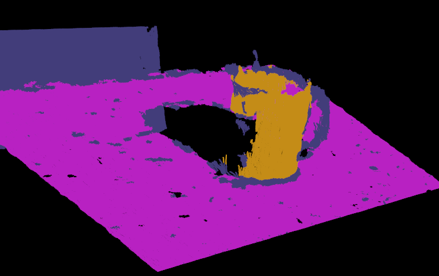
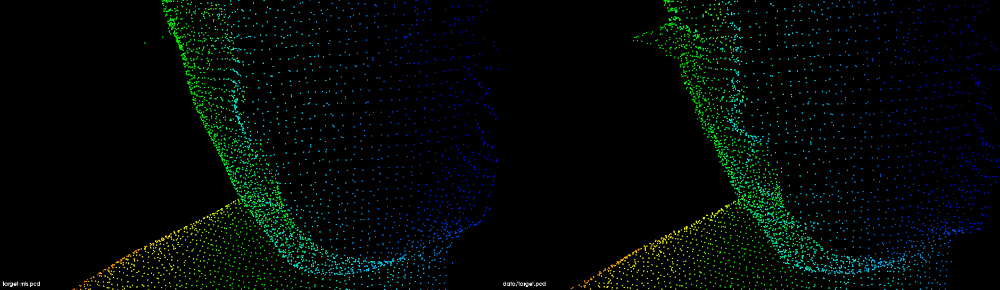
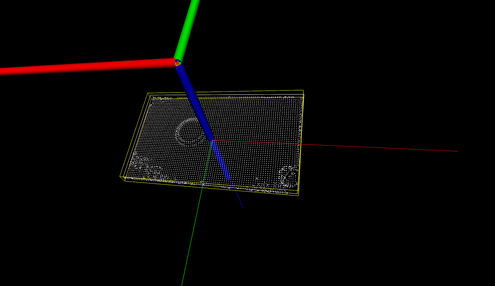
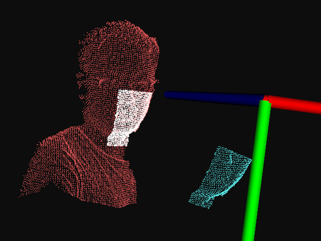

# 1.学习目标

- 能够对点云进行`平面模型`分割
- 能够对点云进行`圆柱体模型`分割
- 能够对点云进行`欧式聚类`分割提取

- 能够了解并进行点云曲面重建

- 能够对获取点云的3D包容盒
- 能够对目标和场景执行点云模板匹配

## 1.1 点云分割

**平面模型分割**

```c++
    // Create the segmentation object
    pcl::SACSegmentation<pcl::PointXYZ> seg;
    // 可选配置：是否优化模型系数
    seg.setOptimizeCoefficients(true);
    // 必选配置：设置分割的模型类型、分割算法、距离阈值、输入点云
    seg.setModelType(pcl::SACMODEL_PLANE);
    seg.setMethodType(pcl::SAC_RANSAC);
    seg.setDistanceThreshold(0.01);
    seg.setInputCloud(cloud);
    // 执行分割操作，并存储分割结果保存到点集合 inliers 及存储平面模型系数 coefficients
    seg.segment(*inliers, *coefficients);
```

**圆柱体模型分割**

本节举例说明了如何采用随机采样一致性估计从带有噪声的点云中提取一个圆柱体模型，整个程序处理流程如下 :

1. 过滤掉远于 1. 5 m 的数据点
2. 估计每个点的表面法线
3. 分割出平面模型 （数据集中的桌面）并保存到磁盘中。
4. 分割圆出柱体模型（数据集中的杯子）并保存到磁盘中。

```c++
#include <pcl/ModelCoefficients.h>
#include <pcl/io/pcd_io.h>
#include <pcl/point_types.h>
#include <pcl/filters/extract_indices.h>
#include <pcl/filters/passthrough.h>
#include <pcl/features/normal_3d.h>
#include <pcl/sample_consensus/method_types.h>
#include <pcl/sample_consensus/model_types.h>
#include <pcl/segmentation/sac_segmentation.h>

typedef pcl::PointXYZ PointT;

int
main(int argc, char **argv) {
    // All the objects needed
    pcl::PCDReader reader;                          // PCD文件读取对象
    pcl::PassThrough<PointT> pass;                  // 直通滤波器
    pcl::NormalEstimation<PointT, pcl::Normal> ne;  // 法线估算对象
    pcl::SACSegmentationFromNormals<PointT, pcl::Normal> seg;   // 分割器
    pcl::PCDWriter writer;                                      // PCD文件写出对象
    pcl::ExtractIndices<PointT> extract;                        // 点提取对象
    pcl::ExtractIndices<pcl::Normal> extract_normals;           // 法线提取对象
    pcl::search::KdTree<PointT>::Ptr tree(new pcl::search::KdTree<PointT>());

    // Datasets
    pcl::PointCloud<PointT>::Ptr cloud(new pcl::PointCloud<PointT>);
    pcl::PointCloud<PointT>::Ptr cloud_filtered(new pcl::PointCloud<PointT>);
    pcl::PointCloud<pcl::Normal>::Ptr cloud_normals(new pcl::PointCloud<pcl::Normal>);//存储法线变量
    pcl::PointCloud<PointT>::Ptr cloud_filtered2(new pcl::PointCloud<PointT>);
    pcl::PointCloud<pcl::Normal>::Ptr cloud_normals2(new pcl::PointCloud<pcl::Normal>);//存储法线变量
    pcl::ModelCoefficients::Ptr coefficients_plane(new pcl::ModelCoefficients), coefficients_cylinder(
            new pcl::ModelCoefficients);
    pcl::PointIndices::Ptr inliers_plane(new pcl::PointIndices), inliers_cylinder(new pcl::PointIndices);

    // Read in the cloud data 读取点云数据
    reader.read("./data/table_scene_mug_stereo_textured.pcd", *cloud);
    std::cerr << "PointCloud has: " << cloud->points.size() << " data points." << std::endl;

    // 直通滤波器
    pass.setInputCloud(cloud);
    pass.setFilterFieldName("z");
    pass.setFilterLimits(0, 1.5);
    pass.filter(*cloud_filtered);
    
    std::cerr << "PointCloud after filtering has: " << cloud_filtered->points.size() << " data points." << std::endl;

    // 估算点云法线
    ne.setSearchMethod(tree);
    ne.setInputCloud(cloud_filtered);
    ne.setKSearch(50);
    ne.compute(*cloud_normals);

    // Create the segmentation object for the planar model and set all the parameters
    //创建分割对象
    seg.setOptimizeCoefficients(true);
    seg.setModelType(pcl::SACMODEL_NORMAL_PLANE);//设置分割对象为平面
    seg.setNormalDistanceWeight(0.1);
    seg.setMethodType(pcl::SAC_RANSAC);
    seg.setMaxIterations(100);
    seg.setDistanceThreshold(0.03);
    seg.setInputCloud(cloud_filtered);
    seg.setInputNormals(cloud_normals);
    // Obtain the plane inliers and coefficients
    seg.segment(*inliers_plane, *coefficients_plane);
    std::cerr << "Plane coefficients: " << *coefficients_plane << std::endl;

    // Extract the planar inliers from the input cloud
    //条件滤波器，
    extract.setInputCloud(cloud_filtered);
    extract.setIndices(inliers_plane);
    extract.setNegative(false);

    // Write the planar inliers to disk
    pcl::PointCloud<PointT>::Ptr cloud_plane(new pcl::PointCloud<PointT>());
    extract.filter(*cloud_plane);
    std::cerr << "PointCloud representing the planar component: " << cloud_plane->points.size() << " data points."
              << std::endl;
    writer.write("table_scene_mug_stereo_textured_plane.pcd", *cloud_plane, false);

    // 条件滤波器
    extract.setNegative(true);
    extract.filter(*cloud_filtered2);
    extract_normals.setNegative(true);
    extract_normals.setInputCloud(cloud_normals);
    extract_normals.setIndices(inliers_plane);
    extract_normals.filter(*cloud_normals2);

    // Create the segmentation object for cylinder segmentation and set all the parameters
    // 设置圆柱体分割对象参数
    seg.setOptimizeCoefficients(true);
    seg.setModelType(pcl::SACMODEL_CYLINDER);   // 设置分割模型为圆柱体
    seg.setMethodType(pcl::SAC_RANSAC);         // 设置采用RANSAC算法进行参数估计
    seg.setNormalDistanceWeight(0.1);           // 设置表面法线权重系数
    seg.setMaxIterations(10000);                // 设置最大迭代次数10000
    seg.setDistanceThreshold(0.05);             // 设置内点到模型的最大距离 0.05m
    seg.setRadiusLimits(0, 0.1);                // 设置圆柱体的半径范围0 -> 0.1m
    seg.setInputCloud(cloud_filtered2);
    seg.setInputNormals(cloud_normals2);

    // Obtain the cylinder inliers and coefficients
    seg.segment(*inliers_cylinder, *coefficients_cylinder);
    std::cerr << "Cylinder coefficients: " << *coefficients_cylinder << std::endl;

    // Write the cylinder inliers to disk
    
    pcl::PointCloud<PointT>::Ptr cloud_cylinder(new pcl::PointCloud<PointT>());
    extract.setInputCloud(cloud_filtered2);
    extract.setIndices(inliers_cylinder);
    extract.setNegative(false);
    extract.filter(*cloud_cylinder);
    
    if (cloud_cylinder->points.empty())
        std::cerr << "Can't find the cylindrical component." << std::endl;
    else {
        std::cerr << "PointCloud representing the cylindrical component: " << cloud_cylinder->points.size()
                  << " data points." << std::endl;
        writer.write("table_scene_mug_stereo_textured_cylinder.pcd", *cloud_cylinder, false);
    }
    return (0);
}
```



## 1.2 点云曲面重建




## 1.3 3D包容盒子

```c++
#include <vector>
#include <thread>

#include <pcl/features/moment_of_inertia_estimation.h>
#include <pcl/io/pcd_io.h>
#include <pcl/point_types.h>
#include <pcl/visualization/cloud_viewer.h>

using namespace std::chrono_literals;

int main (int argc, char** argv)
{
    if (argc != 2)
        return (0);

    pcl::PointCloud<pcl::PointXYZ>::Ptr cloud (new pcl::PointCloud<pcl::PointXYZ> ());
    if (pcl::io::loadPCDFile (argv[1], *cloud) == -1)
        return (-1);

    // 创建惯性矩估算对象，设置输入点云，并进行计算
    pcl::MomentOfInertiaEstimation <pcl::PointXYZ> feature_extractor;
    feature_extractor.setInputCloud (cloud);
    feature_extractor.compute ();

    std::vector <float> moment_of_inertia;
    std::vector <float> eccentricity;
    pcl::PointXYZ min_point_AABB;
    pcl::PointXYZ max_point_AABB;
    pcl::PointXYZ min_point_OBB;
    pcl::PointXYZ max_point_OBB;
    pcl::PointXYZ position_OBB;
    Eigen::Matrix3f rotational_matrix_OBB;
    float major_value, middle_value, minor_value;
    Eigen::Vector3f major_vector, middle_vector, minor_vector;
    Eigen::Vector3f mass_center;

    
    feature_extractor.getMomentOfInertia (moment_of_inertia);// 获取惯性矩
    feature_extractor.getEccentricity (eccentricity);// 获取离心率
    feature_extractor.getAABB (min_point_AABB, max_point_AABB);// 获取AABB盒子
    feature_extractor.getOBB (min_point_OBB, max_point_OBB, position_OBB, rotational_matrix_OBB);// 获取OBB盒子
    feature_extractor.getEigenValues (major_value, middle_value, minor_value);// 获取主轴major_vector，中轴middle_vector，辅助轴minor_vector
    feature_extractor.getEigenVectors (major_vector, middle_vector, minor_vector);// 获取质心
    feature_extractor.getMassCenter (mass_center);

    pcl::visualization::PCLVisualizer::Ptr viewer (new pcl::visualization::PCLVisualizer ("3D Viewer"));
    viewer->setBackgroundColor (0, 0, 0);
    viewer->addCoordinateSystem (1.0);
    viewer->initCameraParameters ();
    viewer->addPointCloud<pcl::PointXYZ> (cloud, "sample cloud");
    
    // 添加AABB包容盒
    viewer->addCube (min_point_AABB.x, max_point_AABB.x, min_point_AABB.y, max_point_AABB.y, min_point_AABB.z, max_point_AABB.z, 1.0, 1.0, 0.0, "AABB");
    viewer->setShapeRenderingProperties(pcl::visualization::PCL_VISUALIZER_REPRESENTATION, pcl::visualization::PCL_VISUALIZER_REPRESENTATION_WIREFRAME, "AABB");

    // 添加OBB包容盒
    Eigen::Vector3f position (position_OBB.x, position_OBB.y, position_OBB.z);
    Eigen::Quaternionf quat (rotational_matrix_OBB);
    
    // position：中心位置
    // quat：旋转矩阵
    // max_point_OBB.x - min_point_OBB.x  宽度
    // max_point_OBB.y - min_point_OBB.y  高度
    // max_point_OBB.z - min_point_OBB.z  深度
    viewer->addCube (position, quat, max_point_OBB.x - min_point_OBB.x, max_point_OBB.y - min_point_OBB.y, max_point_OBB.z - min_point_OBB.z, "OBB");
    viewer->setShapeRenderingProperties(pcl::visualization::PCL_VISUALIZER_REPRESENTATION, pcl::visualization::PCL_VISUALIZER_REPRESENTATION_WIREFRAME, "OBB");

    pcl::PointXYZ center (mass_center (0), mass_center (1), mass_center (2));
    pcl::PointXYZ x_axis (major_vector (0) + mass_center (0), major_vector (1) + mass_center (1), major_vector (2) + mass_center (2));
    pcl::PointXYZ y_axis (middle_vector (0) + mass_center (0), middle_vector (1) + mass_center (1), middle_vector (2) + mass_center (2));
    pcl::PointXYZ z_axis (minor_vector (0) + mass_center (0), minor_vector (1) + mass_center (1), minor_vector (2) + mass_center (2));
    viewer->addLine (center, x_axis, 1.0f, 0.0f, 0.0f, "major eigen vector");
    viewer->addLine (center, y_axis, 0.0f, 1.0f, 0.0f, "middle eigen vector");
    viewer->addLine (center, z_axis, 0.0f, 0.0f, 1.0f, "minor eigen vector");

    while(!viewer->wasStopped())
    {
        viewer->spinOnce (100);
        std::this_thread::sleep_for(100ms);
    }

    return (0);
}
```

黄色的是AABB包容盒，白色的是OBB包容盒



## 原理简述

包围体（包容盒）是一个简单的几何空间，里面包含着复杂形状的物体。为物体添加包围体的目的是快速的进行碰撞检测或者进行精确的碰撞检测之前进行过滤（即当包围体碰撞，才进行精确碰撞检测和处理）。包围体类型包括球体、轴对齐包围盒（AABB）、有向包围盒（OBB）、8-DOP以及凸壳（CONVEX HULL）。

常见包容盒（ Bounding Volumes）分类：

- **包容球**：SPHERE 用球体包围整个几何体，用于相交测试很方便，但是其紧密型差，周围空隙较大，当物体变形后，包围球需要重新计算。当对象进行旋转运动时，包围球不需要做任何更新，这是包围球的优势，即当几何对象频繁进行旋转运动时，使用包围球效率较高。
- **AABB包容盒**：Axially Aligned Bounding Box，3D环境下的AABB盒即一个六面体，每个边都平行于一个坐标平面，较简单，但紧密性较差，当物体旋转、形变之后需要对AABB进行更新。本身的长宽高根据物体大小而定。
- **OBB包容盒**：Oriented Bounding Box，此方法紧密型较好，可以降低参与相交测试的包容盒数目，因此性能要优于AABB和包容球。当物体发生旋转，仅需对OBB进行相同的旋转即可，但是当物体形变后，更新OBB的代价较大，故不适用那些软体的对象。


如上图所示，还有K-DOP，CONVEX HULL等包容盒，越靠右，包容效果好、越紧密。但是检测速度更慢，也更消耗内存资源。

## 1.4 点云模板匹配


